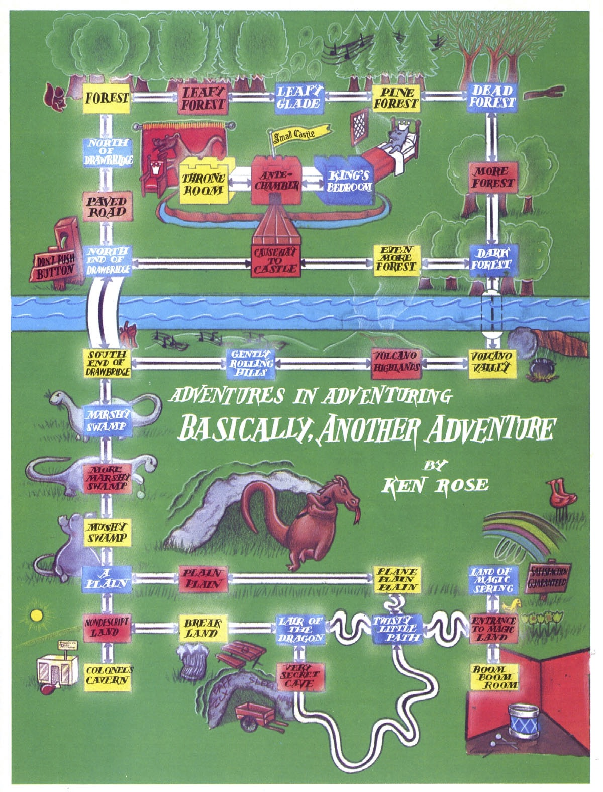

# The Horrible Rotten Dancing Dragon…Strikes!

This game was originally published in Softline magazine in January 1983. It was written in Atari Basic, with instructions provided to port the game from Atari Basic to Applesoft Basic, which I've dutifully applied.

I've preserved this game for historical interest. It's the very first text adventure game that I can remember playing. It's got a dancing dragon, a McRib sandwich, a snarky dinosaur, and a magic spring.

[You can play the BBC micro version online here.](http://bbcmicro.co.uk/jsbeeb/play.php?loadBasic=%20https://raw.githubusercontent.com/dfabulich/horrible-rotten-dancing-dragon-strikes/master/bbcmicro.bas&autorun) (h/t to ahope1 for porting to BBC Micro).

You can also play the game on an [Applesoft BASIC JavaScript interpreter](https://www.calormen.com/jsbasic/). Open [dragon.bas](dragon.bas) and copy and paste the source code into the interpreter. Click "Run" to play the game.

In addition to bug fixes, I've added support for the "look" command, and I made the game print the list of exits.

The magazine includes a full-color map, below.

